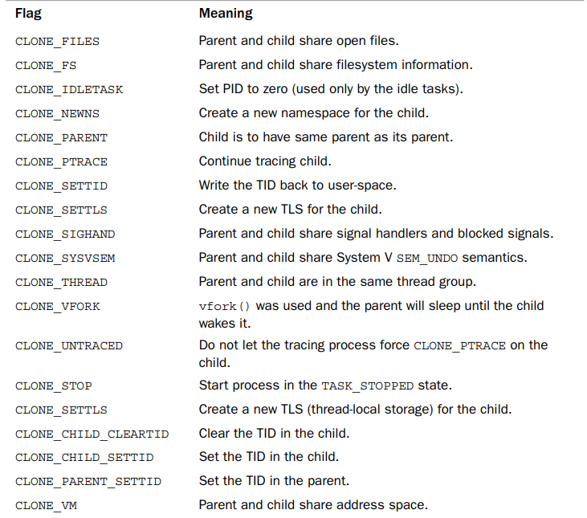

# Process Creation
- Process creation in Unix is unique. There are 2 steps: ```fork()``` and ```exec()```
- ```fork()``` : create a child process that is a copy of the current task. Certain resources, such as pending signals and PID, which are not inherited.
- ```exex()``` : loads a new executable into the address space and begins to execute it.

## Copy-on-Write
- Actually, ```fork()``` does not copy the duplicated data from parent to the child (it does traditionlally). They will share a single copy.
- However, a duplicate is made if the shared data is written and each process receives a unique copy. 
- This technique prevents wasting memory and time to copy data from the parent to the child. Even worst, if the new process immediately execute a new image.

# The Linux implementation of Threads
- Linux doesn't have any special scheduling semantics or data structure to represent threads. A thread is merely a process that shares certain resources with process.
- Each thread has a unique ```task_struct``` and appears to the kernel as a normal process.
> Other OSs such as Microsoft Windows have explicit kernel support for threads.

## Creating threads
- Threads are created the same as normal task, ```clone()``` system call is passed flags corresponding to the specific resourses to be shared.
- A normal ```fork()``` can be implemented as : ```clone(SIGCHLD,0)```


## Kernel threads
- ___Kernel threads___ are useful for the kernel to perfome some operations in the background.
- The significant difference between kernel threads and normal process is that ___kernel threads___ do not have an address space. 
<br> However, they are schedulable and preemptable, the same as normal process
> Run command ps -ef to see the kernel threads
- Indeed, a kernel thread can be created only by another kernel thread. 
<br>_kthreadd_ kernel process will fork all new kernel thread via ```kthread_create()```which create new task via ```clone()``` system call.

> I will write a program to demonstrate how threads/processes created and play with their shared resources.
