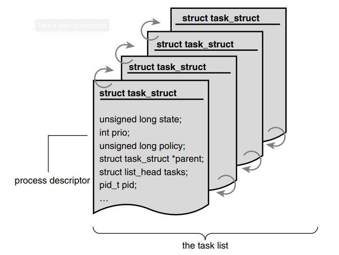
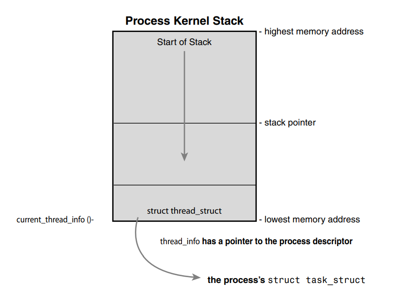
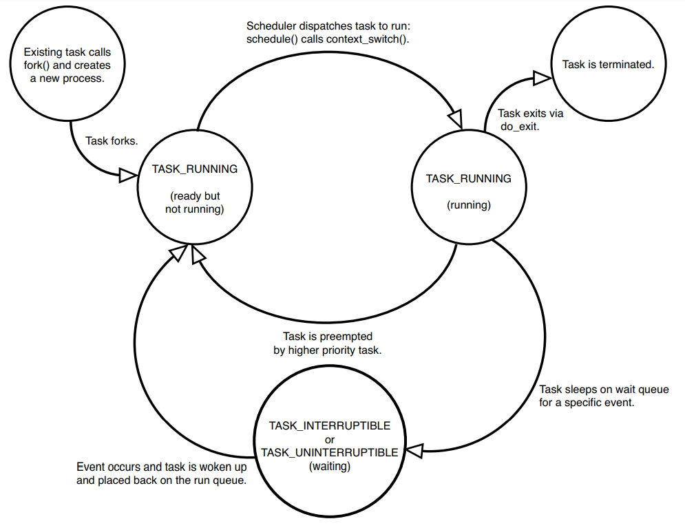

# Process Management
You can answer all of these questions after reading this chapter.
<details>
    <summary>Revise questions: </summary>

        - What is process ?
        - What is thread ?
        - What is process descriptor? 
        - How does kernel store process descriptors?  
        - How does kernel allocate process descriptors?
        - What is process state and how to manipulate them ?
        - How many process states are there ?
        - What is process context ?
        - What is the first process in system (PID = 1) ?
</details>

## The Process
- A __process__ is more than just an executing program code (text section in Unix).
<br>It includes a set of resources such as open files, pending signals, interal kernel data, processor state, a memory address space, one or more threads of execution, and a data section. 
> (I will write a program to show all of these info while running)
- Threads, threads of execution, include unique program counter, process stack, and set of process registers.
- Actually, the kernel schedules individual threads, not processes.

## Process Descriptor and the Task Structure
- The kernel stores the list of processes in a circular doubly linked list called ***task list***. Each element in this task list is a process descriptor.
- ***Process descriptor*** contains all the information about a specific process. 
- In Linux, ```struct task_struct``` definded in ```<linux/sched.h>``` is process descriptor. 
<br>



## Process Creation

### Allocating the Process Descriptor
- The ```struct task_struct``` is allocated via the _slab allocator_ which creates a new structure 
<br>```struct thread_info ``` included in ```<asm/thread_info.h>``` living at the bottom of the stack.
<br>



### Storing the Process Descriptor
- The system identifies processes by a unique ***processs indentification*** value or ***PID***.
- ***PID*** is represented by the opaque type *pid_t*, which is typically an int. <br>
The kernel store ***PID*** as _pid_ inside each process descriptor.
- In fact, most kernel code that deals with processes works directly with ***struct task_struc***. 
<br>Macro **current** is used to look up the process descriptor of the current executing task.
> This macro must be independently implemented by each architecture. (I will write a program use this macro)

### Process State
- Each process on the system is in exactly one of five different states. The ***state*** field of the process descriptor describes current state of the process.
+ TASK_RUNNING
+ TASK_INTERRUPTIBLE
+ TASK_UNINTERRUPTIBLE
+ TASK_TRACED
+ TASK_STOPPED
<br>



### Manipulating the Current Process State
- Kernel code often needs to change a process's state. 
<br>The preferred mechanism : ```set_task_state(task, state);```
<br>The method to set current process's state : ``` set_current_state(state);```
> See ```<linux/sched.h>``` for the implementation of these functions

### Process Context
- When a __user-space__ process enters __kernel-space__, it is in ***process context*** and the macro __current__ is valid.
- __System calls__ and __exception handlers__ are the only interfaces to access to the kernel.
> [!NOTE]
> Other than process context there is interrupt context. In interrupt context, the system is not running on behalf of a process but is executing an interrupt handler. No process is tied to interrupt handlers.
    
### The Process Family Tree    
- All processes are descendants of the ___init___ process, whose PID is 1. 
<br>The ___init___ process reads the system ___initsripts___ and executes more programs, which is the last step of boot process.
- Each ___task_struct___ has a pointer to the parent's ___task_struct___ and a list of children.
- Because ___task list___ is a circular, doubly link list, you can go to any process from a randow process in the process hierarchy.
> I will write a program that follow the process hierarchy and go to the init process
## The Linux implementation of Threads
## Process Termination
## Conclusion
